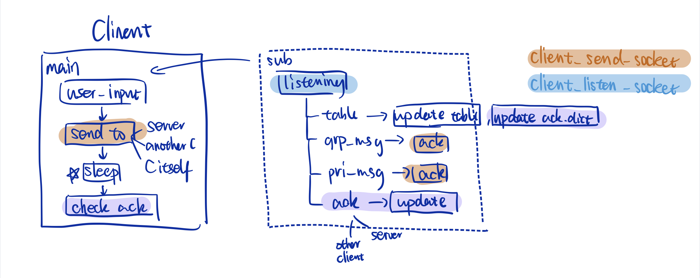
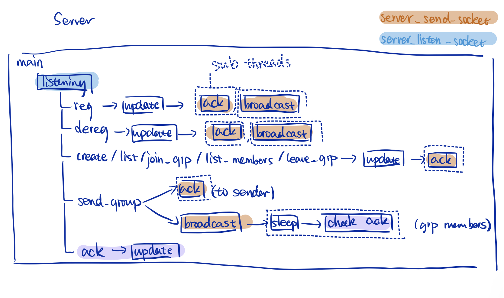

# GroupChatRoomApp-socket-programming
- Name: Ouqi Lin
- UNI: ol2251

## How to Use

### Start the App
Input the below command in command line interface, a server/client will start. You can run one server and multiple clients on one machine. 

#### Server
```python
python3 ChatApp.py -s <server-listen-port>
# example:
python3 ChatApp.py -s 6666
```

#### Client

```python
python3 ChatApp.py -c <client-name> <server-ip> <server-listen-port> <client-listen-port>
# example:
python3 ChatApp.py -c X localhost 6666 7771
```
Note: `;` is not allowed in client name.

### Functions of Client

#### De-registration
Client can deregistrate itself by either method
1.  type in the below command in CLI:
    ```python
    dereg <client-name>
    ```
2.  press `CTRL+C`
3.  close the CLI window  

Note: Client can only dereg itself.

#### Private Chatting
Client can send direct message to another client.
```python
send <receiver-client-name> <message>
```

#### Create A Group
Client can create a group chat room.
```python
create_group <group-name>
```
Note: `;` is not allowed in group name.

#### List Existing Groups
Client can know all available groups before joining.
```python
list_groups
```

#### Join A Group
Client can join into an existing group. Client can only be in one group at a time. When in group, client cannot send private message, but can receive private message.
```python
join_group <group-name>
```

#### Chat in the Group
Client can send group messages to all other clients in the same group.
```python
send_group <group message>
```

#### List Group Members
Client can know the group members of the group it's in.
```python
list_members
```

#### Leave the Group
Client can leave the current group.
```python
leave_group
```

## Program Design
### Server Components
- threads
  - main thread `serverMode()`:  
    keep listening to all kinds of incoming client command requests, and clients' ack reply of group messages.
  - sub threads : 
    - `serverRespond()`: each time server need to respond (e.g. broadcast table, send ack,...), create a sub-thread
    - `sleep_and_wait_for_acks()`: Server needs to receive acks from group members. After server finished sening out a group message, a sub-thread will start. It will first sleep for 500msec, then wake up to check if required acks are received. 
- sockets
  - listening socket:  
    is used in main thread `serverMode()`
  - sending socket:  
    is used in each sub-thread `serverRespond()` and in main thread `serverMode()` when broadcasting group messages.
    
- major variables
  - `client_table`:  
    maintain client information (name, IP, port number, online status)
  - `group_table`:  
    maintain group information (name, members set)
    NOTE: I allow offline members to keep being in group table, no matter they leave silently or send explicit deregistration request. The server may try to broadcast group messages to offline members, and since offline members never reply acks, the server will then find out and remove them from group tables.
  - `ack_dict`:  
    record acknowledgement requirements of group members, for each group message which is uniquely indentified by (`sender_name`, `message timestamp`)
- locks
    - `send_lock`:  
        will take effects each time `server_send_socket` is used.
    - `group_lock`:  
        will take effects each time `group_table` is read or written (e.g. create new groups, add new members, remove nonresponsive members).
    - `ack_lock`:  
        will take effects when new ack requirements are added, modified and deleted.

### Client Components
- threads
  - keyboard thread (main thread) `clientMode()`: 
    1. continue taking user inputs
    1. verify user input is a valid command
    1. structure the sending-out packet format
    1. use `client_send_socket` to send packet to server or another client, wait 500msec for ack, retry for 5 times
    1. based on server or another client's ack and additional information, perform corresponding actions
  - listening thread `clientListen()`: start before keyboard thread, sitting aside main thread, listening to all kinds of incoming messages
    - acknowledgements
    - client table broadcasted from server
    - group message broadcasted from server
    - private message sent from another client
- sockets
  - sending socket:  
    is used in the keyboard thread `clientMode()`, and listening thread `clientListen()` when need to reply ack for group messages and private messages
  - listening socket:  
    is used in the listening thread `clientListen()`
- major variables
  - `client_table`:  
    maintain client information (name, IP, port number, online status)
  - `ack_dict`:  
    record acknowledgement requirements of server and all clients, default `False`; if received ack, change to `True`
  - `pri_msg_queue`:  
    when client in group mode, the private messages it received will be kept in `pri_msg_queue`
- locks
    - `send_lock`:  
        will take effects each time `client_send_socket` is used.
    - `ack_lock`:  
        will take effects when keyboard thread is trying to read, and when listening thread is trying to write.
  
### Diagram



### Packet Format
All packets will be wrapped in a uniform formats, including client requests, ack response, broadcast tables, etc.
```
sender_listening_port:
<sender_listening_port>
sender_name:
<sender_name>
msg_type:
<reg_ack/ack/table/grp_msg/pri_msg> (client may receive)
<reg/dereg/create_group/list_groups/join_group/leave_group/list_members/send_group/ack/kick> (server may receive)
message:
<actual message>
```

- `sender_name`:  
    uniquely identify an instance, is used as a unique user id in this implementation. Server's "sender_name" is "server". Client's "sender_name" is the name provided when register. Therefore, I disallow duplicate name for client registration.
- `msg_type`:
    In order to identify the packet content sending between instances and direct to the corresponding actions, I use this `msg_type` field as part of the packet header.  
    - Client may receive: `reg_ack` registration request acknowledgement; `ack` from server and other clients; `table` client_table broadcasted from server; `grp_msg` group message broadcasted from server; `pri_msg` private message sent from another client.
    - Server may receive: `reg/dereg/create_group/list_groups/join_group/leave_group/list_members/send_group` corresponding to every client function. `ack` from group members receiving group messages. `kick` when client A find client B not responding to A's message, A will notify server to change B's status to offline.

### Known Bugs


## Test Cases
### Test Cases 1
Server 
```
ol2251@csee4119-ol2251-instance-1:~$ python3 ChatApp.py -s 6666
>>> Server is online
>>> Client table updated.
{'X': {'ip': '127.0.0.1', 'port': 7771, 'online': True}}
>>> Client table updated.
{'X': {'ip': '127.0.0.1', 'port': 7771, 'online': True}, 'Y': {'ip': '127.0.0.1', 'port': 7772, 'online': True}}
>>> Client table updated.
{'X': {'ip': '127.0.0.1', 'port': 7771, 'online': True}, 'Y': {'ip': '127.0.0.1', 'port': 7772, 'online': True}, 'Z': {'ip': '127.0.0.1', 'port': 7773, 'online': True}}
>>> Client table updated.
{'X': {'ip': '127.0.0.1', 'port': 7771, 'online': False}, 'Y': {'ip': '127.0.0.1', 'port': 7772, 'online': True}, 'Z': {'ip': '127.0.0.1', 'port': 7773, 'online': True}}
```

X:
```
ol2251@csee4119-ol2251-instance-1:~$ python3 ChatApp.py -c X 127.0.0.1 6666 7771
>>> Client start listening
>>> Registration request sent
>>> 
>>> Welcome, You are registered.
>>> Client table updated.
{'X': {'ip': '127.0.0.1', 'port': 7771, 'online': True}}
>>> 
>>> Client table updated.
{'X': {'ip': '127.0.0.1', 'port': 7771, 'online': True}, 'Y': {'ip': '127.0.0.1', 'port': 7772, 'online': True}}
>>> 
>>> Client table updated.
{'X': {'ip': '127.0.0.1', 'port': 7771, 'online': True}, 'Y': {'ip': '127.0.0.1', 'port': 7772, 'online': True}, 'Z': {'ip': '127.0.0.1', 'port': 7773, 'online': True}}
>>> send Y hello, I am X

>>> Message received by Y.
>>> 
>>> Y: hello, I am Y, nice to meet you 
>>> send Z hello, this is X, are you Z?

>>> Message received by Z.
>>> 
>>> Z: yes, this is Z. nice to meet you~ 
>>> dereg X

>>> You are Offline. Bye.
```

Y:
```
ol2251@csee4119-ol2251-instance-1:~$ python3 ChatApp.py -c Y localhost 6666 7772
>>> Client start listening
>>> Registration request sent
>>> 
>>> Welcome, You are registered.
>>> Client table updated.
{'X': {'ip': '127.0.0.1', 'port': 7771, 'online': True}, 'Y': {'ip': '127.0.0.1', 'port': 7772, 'online': True}}
>>> 
>>> Client table updated.
{'X': {'ip': '127.0.0.1', 'port': 7771, 'online': True}, 'Y': {'ip': '127.0.0.1', 'port': 7772, 'online': True}, 'Z': {'ip': '127.0.0.1', 'port': 7773, 'online': True}}
>>> 
>>> X: hello, I am X 
>>> send X hello, I am Y, nice to meet you

>>> Message received by X.
>>> send Z hello Z, I am Y

>>> Message received by Z.
>>> 
>>> Z: sure. Hope you have a nice day 
>>> 
>>> Client table updated.
{'X': {'ip': '127.0.0.1', 'port': 7771, 'online': False}, 'Y': {'ip': '127.0.0.1', 'port': 7772, 'online': True}, 'Z': {'ip': '127.0.0.1', 'port': 7773, 'online': True}}
>>> send X hello X, are you still there?

>>> No ACK from X, message not delivered
>>> Report this issue to server
>>> ^Col2251@csee4119-ol2251-instance-1:~$ 
```

Z:
```
ol2251@csee4119-ol2251-instance-1:~$ python3 ChatApp.py -c Z localhost 6666 7773
>>> Client start listening
>>> Registration request sent
>>> 
>>> Welcome, You are registered.
>>> Client table updated.
{'X': {'ip': '127.0.0.1', 'port': 7771, 'online': True}, 'Y': {'ip': '127.0.0.1', 'port': 7772, 'online': True}, 'Z': {'ip': '127.0.0.1', 'port': 7773, 'online': True}}
>>> 
>>> X: hello, this is X, are you Z? 
>>> send X yes, this is Z. nice to meet you~

>>> Message received by X.
>>> 
>>> Y: hello Z, I am Y 
>>> send Y sure. Hope you have a nice day

>>> Message received by Y.
>>> 
>>> Client table updated.
{'X': {'ip': '127.0.0.1', 'port': 7771, 'online': False}, 'Y': {'ip': '127.0.0.1', 'port': 7772, 'online': True}, 'Z': {'ip': '127.0.0.1', 'port': 7773, 'online': True}}
>>> send X hello X, I am Z, are you still there?

>>> No ACK from X, message not delivered
>>> Report this issue to server
>>> ^Col2251@csee4119-ol2251-instance-1:~$ 
```

### Test Case 2 (updated version, consistent with https://edstem.org/us/courses/35445/discussion/2838367)
Server:
```
ol2251@csee4119-ol2251-instance-1:~$ python3 ChatApp.py -s 6666
>>> Server is online
>>> Client table updated.
{'X': {'ip': '127.0.0.1', 'port': 7771, 'online': True}}
>>> Client table updated.
{'X': {'ip': '127.0.0.1', 'port': 7771, 'online': True}, 'Y': {'ip': '127.0.0.1', 'port': 7772, 'online': True}}
>>> Client table updated.
{'X': {'ip': '127.0.0.1', 'port': 7771, 'online': True}, 'Y': {'ip': '127.0.0.1', 'port': 7772, 'online': True}, 'Z': {'ip': '127.0.0.1', 'port': 7773, 'online': True}}
^CTraceback (most recent call last):
  File "ChatApp.py", line 884, in <module>
    server.serverMode()
  File "ChatApp.py", line 145, in serverMode
    in_packet, addr = self.server_listen_socket.recvfrom(4096)
KeyboardInterrupt
```

X:
```
ol2251@csee4119-ol2251-instance-1:~$ python3 ChatApp.py -c X 127.0.0.1 6666 7771
>>> Client start listening
>>> Registration request sent
>>> 
>>> Welcome, You are registered.
>>> Client table updated.
{'X': {'ip': '127.0.0.1', 'port': 7771, 'online': True}}
>>> 
>>> Client table updated.
{'X': {'ip': '127.0.0.1', 'port': 7771, 'online': True}, 'Y': {'ip': '127.0.0.1', 'port': 7772, 'online': True}}
>>> 
>>> Client table updated.
{'X': {'ip': '127.0.0.1', 'port': 7771, 'online': True}, 'Y': {'ip': '127.0.0.1', 'port': 7772, 'online': True}, 'Z': {'ip': '127.0.0.1', 'port': 7773, 'online': True}}
>>> send Z this is a private message, you should receive although server is offline

>>> Message received by Z.
>>> 
```

Y:
```
ol2251@csee4119-ol2251-instance-1:~$ python3 ChatApp.py -c Y localhost 6666 7772
>>> Client start listening
>>> Registration request sent
>>> 
>>> Welcome, You are registered.
>>> Client table updated.
{'X': {'ip': '127.0.0.1', 'port': 7771, 'online': True}, 'Y': {'ip': '127.0.0.1', 'port': 7772, 'online': True}}
>>> 
>>> Client table updated.
{'X': {'ip': '127.0.0.1', 'port': 7771, 'online': True}, 'Y': {'ip': '127.0.0.1', 'port': 7772, 'online': True}, 'Z': {'ip': '127.0.0.1', 'port': 7773, 'online': True}}
>>> dereg Y

>>> Server not responding
>>> Exitingol2251@csee4119-ol2251-instance-1:~$ 

```

Z:
```
ol2251@csee4119-ol2251-instance-1:~$ python3 ChatApp.py -c Z localhost 6666 7773
>>> Client start listening
>>> Registration request sent
>>> 
>>> Welcome, You are registered.
>>> Client table updated.
{'X': {'ip': '127.0.0.1', 'port': 7771, 'online': True}, 'Y': {'ip': '127.0.0.1', 'port': 7772, 'online': True}, 'Z': {'ip': '127.0.0.1', 'port': 7773, 'online': True}}
>>> 
>>> X: this is a private message, you should receive although server is offline 
>>> 
```

### Test Case 3
Server:
```
ol2251@csee4119-ol2251-instance-1:~$ python3 ChatApp.py -s 6666
>>> Server is online
>>> Client table updated.
{'X': {'ip': '127.0.0.1', 'port': 7771, 'online': True}}
>>> Client table updated.
{'X': {'ip': '127.0.0.1', 'port': 7771, 'online': True}, 'Y': {'ip': '127.0.0.1', 'port': 7772, 'online': True}}
>>> Client table updated.
{'X': {'ip': '127.0.0.1', 'port': 7771, 'online': True}, 'Y': {'ip': '127.0.0.1', 'port': 7772, 'online': True}, 'Z': {'ip': '127.0.0.1', 'port': 7773, 'online': True}}
>>> Client table updated.
{'X': {'ip': '127.0.0.1', 'port': 7771, 'online': True}, 'Y': {'ip': '127.0.0.1', 'port': 7772, 'online': True}, 'Z': {'ip': '127.0.0.1', 'port': 7773, 'online': True}, 'A': {'ip': '127.0.0.1', 'port': 7774, 'online': True}}
>>> Client X created group roomA successfully
>>> Group table updated.
{'roomA': set()}
>>> Client X joined group roomA
>>> Group table updated.
{'roomA': {'X'}}
>>> Client Y joined group roomA
>>> Group table updated.
{'roomA': {'Y', 'X'}}
>>> Client Z joined group roomA
>>> Group table updated.
{'roomA': {'Y', 'X', 'Z'}}
>>> Client X sent group message: hello everyone, I am X 
>>> Client Z left group
>>> Group table updated.
{'roomA': {'Y', 'X'}}
```

X:
```
ol2251@csee4119-ol2251-instance-1:~$ python3 ChatApp.py -c X 127.0.0.1 6666 7771
>>> Client start listening
>>> Registration request sent
>>> 
>>> Welcome, You are registered.
>>> Client table updated.
{'X': {'ip': '127.0.0.1', 'port': 7771, 'online': True}}
>>> 
>>> Client table updated.
{'X': {'ip': '127.0.0.1', 'port': 7771, 'online': True}, 'Y': {'ip': '127.0.0.1', 'port': 7772, 'online': True}}
>>> 
>>> Client table updated.
{'X': {'ip': '127.0.0.1', 'port': 7771, 'online': True}, 'Y': {'ip': '127.0.0.1', 'port': 7772, 'online': True}, 'Z': {'ip': '127.0.0.1', 'port': 7773, 'online': True}}
>>> 
>>> Client table updated.
{'X': {'ip': '127.0.0.1', 'port': 7771, 'online': True}, 'Y': {'ip': '127.0.0.1', 'port': 7772, 'online': True}, 'Z': {'ip': '127.0.0.1', 'port': 7773, 'online': True}, 'A': {'ip': '127.0.0.1', 'port': 7774, 'online': True}}
>>> create_group roomA

>>> Group roomA created by Server.
>>> join_group roomA

>>> Entered group roomA successfully
>>> (roomA) send_group hello everyone, I am X

>>> (roomA) Message received by Server.
>>> (roomA) 
```

Y:
```
ol2251@csee4119-ol2251-instance-1:~$ python3 ChatApp.py -c Y localhost 6666 7772
>>> Client start listening
>>> Registration request sent
>>> 
>>> Welcome, You are registered.
>>> Client table updated.
{'X': {'ip': '127.0.0.1', 'port': 7771, 'online': True}, 'Y': {'ip': '127.0.0.1', 'port': 7772, 'online': True}}
>>> 
>>> Client table updated.
{'X': {'ip': '127.0.0.1', 'port': 7771, 'online': True}, 'Y': {'ip': '127.0.0.1', 'port': 7772, 'online': True}, 'Z': {'ip': '127.0.0.1', 'port': 7773, 'online': True}}
>>> 
>>> Client table updated.
{'X': {'ip': '127.0.0.1', 'port': 7771, 'online': True}, 'Y': {'ip': '127.0.0.1', 'port': 7772, 'online': True}, 'Z': {'ip': '127.0.0.1', 'port': 7773, 'online': True}, 'A': {'ip': '127.0.0.1', 'port': 7774, 'online': True}}
>>> join_group roomA

>>> Entered group roomA successfully
>>> (roomA) 
>>> (roomA) Group_Message X: hello everyone, I am X 
>>> (roomA) 
```

Z:
```
ol2251@csee4119-ol2251-instance-1:~$ python3 ChatApp.py -c Z localhost 6666 7773
>>> Client start listening
>>> Registration request sent
>>> 
>>> Welcome, You are registered.
>>> Client table updated.
{'X': {'ip': '127.0.0.1', 'port': 7771, 'online': True}, 'Y': {'ip': '127.0.0.1', 'port': 7772, 'online': True}, 'Z': {'ip': '127.0.0.1', 'port': 7773, 'online': True}}
>>> 
>>> Client table updated.
{'X': {'ip': '127.0.0.1', 'port': 7771, 'online': True}, 'Y': {'ip': '127.0.0.1', 'port': 7772, 'online': True}, 'Z': {'ip': '127.0.0.1', 'port': 7773, 'online': True}, 'A': {'ip': '127.0.0.1', 'port': 7774, 'online': True}}
>>> join_group roomA

>>> Entered group roomA successfully
>>> (roomA) 
>>> (roomA) Group_Message X: hello everyone, I am X 
>>> (roomA) leave_group

>>> Leave group chat roomA
>>> A: hello Z, I am A, I am not in the group. You should receive this msg later 
>>> 
```

A:
```
ol2251@csee4119-ol2251-instance-1:~$ python3 ChatApp.py -c A localhost 6666 7774
>>> Client start listening
>>> Registration request sent
>>> 
>>> Welcome, You are registered.
>>> Client table updated.
{'X': {'ip': '127.0.0.1', 'port': 7771, 'online': True}, 'Y': {'ip': '127.0.0.1', 'port': 7772, 'online': True}, 'Z': {'ip': '127.0.0.1', 'port': 7773, 'online': True}, 'A': {'ip': '127.0.0.1', 'port': 7774, 'online': True}}
>>> send Z hello Z, I am A, I am not in the group. You should receive this msg later

>>> Message received by Z.
>>> 
```

### Test Case 4 -- valid registration information
1. Server tries to start with port 65536, fail because of port number out of range.
2. Server tries to start with port 666a, fail because of invalid port number.
3. Server starts with port 6666
4. Client X register with port 7771
5. A new client Y tries to regitser with port 7771. Fail because of duplicated port number.
6. A new client Y tries to regitser with port 77777. Fail because of port number out of range.
7. A new client Y tries to regitser with port 777a. Fail because of invalid port number.
8. A new client Y tries to regitser with server IP 127.0.9999.1. Fail because of invalid IP.
9. A new client trites to register with port 7772, but named X. Fail because duplicated name.

Server 
```
ol2251@csee4119-ol2251-instance-1:~$ python3 ChatApp.py -s 65536
Invalid server port number
ol2251@csee4119-ol2251-instance-1:~$ python3 ChatApp.py -s 666a
Invalid server port number
ol2251@csee4119-ol2251-instance-1:~$ python3 ChatApp.py -s 6666
>>> Server is online
>>> Client table updated.
{'X': {'ip': '127.0.0.1', 'port': 7771, 'online': True}}
```

X
```
ol2251@csee4119-ol2251-instance-1:~$ python3 ChatApp.py -c X 127.0.0.1 6666 7771
>>> Client start listening
>>> Registration request sent
>>> 
>>> Welcome, You are registered.
>>> Client table updated.
{'X': {'ip': '127.0.0.1', 'port': 7771, 'online': True}}
>>>                                
```

A new client trying to register:
```
ol2251@csee4119-ol2251-instance-1:~$ python3 ChatApp.py -c Y localhost 6666 7771
Traceback (most recent call last):
  File "ChatApp.py", line 926, in <module>
    client = Client(name, server_ip, server_listen_port, client_listen_port)
  File "ChatApp.py", line 436, in __init__
    self.client_listen_socket.bind((self.host, self.client_listen_port))
OSError: [Errno 98] Address already in use
ol2251@csee4119-ol2251-instance-1:~$ python3 ChatApp.py -c Y localhost 6666 77777
Invalid client port number
ol2251@csee4119-ol2251-instance-1:~$ python3 ChatApp.py -c Y localhost 6666 777a
Invalid client port number
ol2251@csee4119-ol2251-instance-1:~$ python3 ChatApp.py -c Y 127.0.9999.1 6666 777a
Invalid server ip address. Try again.
ol2251@csee4119-ol2251-instance-1:~$ python3 ChatApp.py -c X 127.0.0.1 6666 7772
>>> Client start listening
>>> Registration request sent
>>> 
>>> Someone has already used this name. Try another one.ol2251@csee4119-ol2251-instance-1:~$ 
```

### Test Case 5 -- dereg behaviors
1. Server starts
2. client X starts
3. client Y starts
4. Y tries to dereg X, fail
5. client X create group roomA
6. client X join group roomA
7. Y sends private message to X, X doesn't print out message right away
8. **X dereg itself, before actual exits, X first print out private message from Y, then exit**

Server:
```
ol2251@csee4119-ol2251-instance-1:~$ python3 ChatApp.py -s 6666
>>> Server is online
>>> Client table updated.
{'X': {'ip': '127.0.0.1', 'port': 7771, 'online': True}}
>>> Client table updated.
{'X': {'ip': '127.0.0.1', 'port': 7771, 'online': True}, 'Y': {'ip': '127.0.0.1', 'port': 7772, 'online': True}}
>>> Client X created group roomA successfully
>>> Group table updated.
{'roomA': set()}
>>> Client X joined group roomA
>>> Group table updated.
{'roomA': {'X'}}
>>> Client table updated.
{'X': {'ip': '127.0.0.1', 'port': 7771, 'online': False}, 'Y': {'ip': '127.0.0.1', 'port': 7772, 'online': True}}
```

X:
```
ol2251@csee4119-ol2251-instance-1:~$ python3 ChatApp.py -c X localhost 6666 7771
>>> Client start listening
>>> Registration request sent
>>> 
>>> Welcome, You are registered.
>>> Client table updated.
{'X': {'ip': '127.0.0.1', 'port': 7771, 'online': True}}
>>> 
>>> Client table updated.
{'X': {'ip': '127.0.0.1', 'port': 7771, 'online': True}, 'Y': {'ip': '127.0.0.1', 'port': 7772, 'online': True}}
>>> create_group roomA

>>> Group roomA created by Server.
>>> join_group roomA

>>> Entered group roomA successfully
>>> (roomA) dereg X

>>> You are Offline. Bye.
>>> Y: hello, I am y ol2251@csee4119-ol2251-instance-1:~$ 
```

Y:
```
ol2251@csee4119-ol2251-instance-1:~$ python3 ChatApp.py -c Y 127.0.0.1 6666 7772
>>> Client start listening
>>> Registration request sent
>>> 
>>> Welcome, You are registered.
>>> Client table updated.
{'X': {'ip': '127.0.0.1', 'port': 7771, 'online': True}, 'Y': {'ip': '127.0.0.1', 'port': 7772, 'online': True}}
>>> dereg X

>>> Invalid command
>>> send X hello, I am y

>>> Message received by X.
>>> 
>>> Client table updated.
{'X': {'ip': '127.0.0.1', 'port': 7771, 'online': False}, 'Y': {'ip': '127.0.0.1', 'port': 7772, 'online': True}}
>>> 
```

### Test Case 6 -- server offline, group member behavior
1. Server starts
2. client X starts
3. client Y starts
4. X create group roomA
6. X join group roomA
7. Y sends private message to X, X doesn't print out message right away
8. **Server goes down **
9. **X tries to send group message, find out server is down, X will print out Y's private message before actual exiting**

Server:
```
ol2251@csee4119-ol2251-instance-1:~$ python3 ChatApp.py -s 6666
>>> Server is online
>>> Client table updated.
{'X': {'ip': '127.0.0.1', 'port': 7771, 'online': True}}
>>> Client table updated.
{'X': {'ip': '127.0.0.1', 'port': 7771, 'online': True}, 'Y': {'ip': '127.0.0.1', 'port': 7772, 'online': True}}
>>> Client X created group roomA successfully
>>> Group table updated.
{'roomA': set()}
>>> Client X joined group roomA
>>> Group table updated.
{'roomA': {'X'}}
^CTraceback (most recent call last):
  File "ChatApp-v2.py", line 879, in <module>
    server.serverMode()
  File "ChatApp-v2.py", line 137, in serverMode
    in_packet, addr = self.server_listen_socket.recvfrom(4096)
KeyboardInterrupt
ol2251@csee4119-ol2251-instance-1:~$ 
```

X:
```
ol2251@csee4119-ol2251-instance-1:~$ python3 ChatApp.py -c X 127.0.0.1 6666 7771
>>> Client start listening
>>> Registration request sent
>>> 
>>> Welcome, You are registered.
>>> Client table updated.
{'X': {'ip': '127.0.0.1', 'port': 7771, 'online': True}}
>>> 
>>> Client table updated.
{'X': {'ip': '127.0.0.1', 'port': 7771, 'online': True}, 'Y': {'ip': '127.0.0.1', 'port': 7772, 'online': True}}
>>> create_group roomA

>>> Group roomA created by Server.
>>> join_group roomA

>>> Entered group roomA successfully
>>> (roomA) send_group hello everyone

>>> (roomA) Server not responding
>>> (roomA) Exiting
>>> Y: hello this is msg1 
>>> Y: hello this is msg 2 ol2251@csee4119-ol2251-instance-1:~$ 
```

Y:
```
ol2251@csee4119-ol2251-instance-1:~$ python3 ChatApp.py -c Y 127.0.0.1 6666 7772
>>> Client start listening
>>> Registration request sent
>>> 
>>> Welcome, You are registered.
>>> Client table updated.
{'X': {'ip': '127.0.0.1', 'port': 7771, 'online': True}, 'Y': {'ip': '127.0.0.1', 'port': 7772, 'online': True}}
>>> send X hello this is msg1

>>> Message received by X.
>>> send X hello this is msg 2

>>> Message received by X.
>>> 
```

### Test Case 7 -- group behaviors, valid command check
1. Server starts
2. client X starts
3. X's sequential behavior:
    1.   create group roomA
    2.   create group roomA again, fail because of duplicate room name
    3.   create group roomB;, fail because ';' is not allowed
    4.   create group roomB
    6.   join group roomC, fail because roomC does not exist
    7.   join group roomA
    8.   send group message, no one will print out this message, because only X in roomA
4. client Y starts
5. Y's sequential behavior:
    1.  list groups
    2.  join group roomA
    3.  send group message, X will print out this message
    4.  create group roomD, fail because in groupMode, this is an invalid command
    5.  list groups, fail because in groupMode, this is an invalid command
    6.  join group roomB, fail because in groupMode, this is an invalid command
    7.  send private message to X, fail because in groupMode, this is an invalid command
6. client Z starts
    1.  send roomA group message, fail because in NormalModel, this is an invalid command
    2.  list group members, fail because in NormalModel, this is an invalid command
    3.  leave group, fail because in NormalModel, this is an invalid command
    4.  list groups
    5.  join group roomA
    6.  list members
    7.  send group message, X and Y will print out this message
    8.  dereg itself
7. Y's sequential behavior
    1.  send group message, X will print out this message, Z will not because already offline
8. Server tries to broadcast message to Z, but find out Z no reply, so remove Z from group table A.
9. Server exit 
10. X tries to send group message, but find out Server already offline, so X exits as well.

Server:
```
ol2251@csee4119-ol2251-instance-1:~$ python3 ChatApp.py -s 6666
>>> Server is online
>>> Client table updated.
{'X': {'ip': '127.0.0.1', 'port': 7771, 'online': True}}
>>> Client X created group roomA successfully
>>> Group table updated.
{'roomA': set()}
>>> Client X creating group roomA failed, group already exists
>>> Client X created group roomB successfully
>>> Group table updated.
{'roomA': set(), 'roomB': set()}
>>> Client X joining group roomC failed, group does not exist
>>> Client X joined group roomA
>>> Group table updated.
{'roomA': {'X'}, 'roomB': set()}
>>> Client X sent group message: hello everyone 
>>> Client table updated.
{'X': {'ip': '127.0.0.1', 'port': 7771, 'online': True}, 'Y': {'ip': '127.0.0.1', 'port': 7772, 'online': True}}
>>> Client Y requested listing groups, current groups:
>>> roomA
>>> roomB
>>> Client Y joined group roomA
>>> Group table updated.
{'roomA': {'X', 'Y'}, 'roomB': set()}
>>> Client Y sent group message: hello everyone in roomA, I am Y 
>>> Client table updated.
{'X': {'ip': '127.0.0.1', 'port': 7771, 'online': True}, 'Y': {'ip': '127.0.0.1', 'port': 7772, 'online': True}, 'Z': {'ip': '127.0.0.1', 'port': 7773, 'online': True}}
>>> Client Z requested listing groups, current groups:
>>> roomA
>>> roomB
>>> Client Z joined group roomA
>>> Group table updated.
{'roomA': {'X', 'Y', 'Z'}, 'roomB': set()}
>>> Client Z requested listing members of group roomA:
>>> X
>>> Y
>>> Z
>>> Client Z sent group message: hello I am Z nice to meet you all~ 
>>> Client table updated.
{'X': {'ip': '127.0.0.1', 'port': 7771, 'online': True}, 'Y': {'ip': '127.0.0.1', 'port': 7772, 'online': True}, 'Z': {'ip': '127.0.0.1', 'port': 7773, 'online': False}}
>>> Client Y sent group message: how many people are still in this group? 
>>> Client Z not responsive, removed from roomA
>>> Group table updated.
{'roomA': {'X', 'Y'}, 'roomB': set()}
^CTraceback (most recent call last):
  File "ChatApp-v3.py", line 879, in <module>
    server.serverMode()
  File "ChatApp-v3.py", line 137, in serverMode
    in_packet, addr = self.server_listen_socket.recvfrom(4096)
KeyboardInterrupt
ol2251@csee4119-ol2251-instance-1:~$ 
```

X:
```
ol2251@csee4119-ol2251-instance-1:~$ python3 ChatApp.py -c X 127.0.0.1 6666 7771
>>> Client start listening
>>> Registration request sent
>>> 
>>> Welcome, You are registered.
>>> Client table updated.
{'X': {'ip': '127.0.0.1', 'port': 7771, 'online': True}}
>>> create_group roomA

>>> Group roomA created by Server.
>>> create_group roomA

>>> Group roomA already exists.
>>> create_group roomB;

>>> Group name should not contain ';'. Try again.
>>> create_group roomB

>>> Group roomB created by Server.
>>> join_group roomC

>>> Group roomC does not exist
>>> join_group roomA

>>> Entered group roomA successfully
>>> (roomA) send_group hello everyone

>>> (roomA) Message received by Server.
>>> (roomA) 
>>> (roomA) Client table updated.
{'X': {'ip': '127.0.0.1', 'port': 7771, 'online': True}, 'Y': {'ip': '127.0.0.1', 'port': 7772, 'online': True}}
>>> (roomA) 
>>> (roomA) Group_Message Y: hello everyone in roomA, I am Y 
>>> (roomA) 
>>> (roomA) Client table updated.
{'X': {'ip': '127.0.0.1', 'port': 7771, 'online': True}, 'Y': {'ip': '127.0.0.1', 'port': 7772, 'online': True}, 'Z': {'ip': '127.0.0.1', 'port': 7773, 'online': True}}
>>> (roomA) 
>>> (roomA) Group_Message Z: hello I am Z nice to meet you all~ 
>>> (roomA) 
>>> (roomA) Client table updated.
{'X': {'ip': '127.0.0.1', 'port': 7771, 'online': True}, 'Y': {'ip': '127.0.0.1', 'port': 7772, 'online': True}, 'Z': {'ip': '127.0.0.1', 'port': 7773, 'online': False}}
>>> (roomA) 
>>> (roomA) Group_Message Y: how many people are still in this group? 
>>> (roomA) send_group I believe there's just us two, but you can't receive this msg anymore because server is offline

>>> (roomA) Server not responding
>>> (roomA) Exitingol2251@csee4119-ol2251-instance-1:~$ 
```

Y:
```
ol2251@csee4119-ol2251-instance-1:~$ python3 ChatApp.py -c Y 127.0.0.1 6666 7772
>>> Client start listening
>>> Registration request sent
>>> 
>>> Welcome, You are registered.
>>> Client table updated.
{'X': {'ip': '127.0.0.1', 'port': 7771, 'online': True}, 'Y': {'ip': '127.0.0.1', 'port': 7772, 'online': True}}
>>> list_groups

>>> Available group chats:
>>> roomA
>>> roomB
>>> join_group roomA

>>> Entered group roomA successfully
>>> (roomA) send_group hello everyone in roomA, I am Y

>>> (roomA) Message received by Server.
>>> (roomA) create_group roomD

>>> (roomA) Invalid command
>>> (roomA) list_groups

>>> (roomA) Invalid command
>>> (roomA) join_group roomB

>>> (roomA) Invalid command
>>> (roomA) send X hello X, can I send this message?

>>> (roomA) Invalid command
>>> (roomA) 
>>> (roomA) Client table updated.
{'X': {'ip': '127.0.0.1', 'port': 7771, 'online': True}, 'Y': {'ip': '127.0.0.1', 'port': 7772, 'online': True}, 'Z': {'ip': '127.0.0.1', 'port': 7773, 'online': True}}
>>> (roomA) 
>>> (roomA) Group_Message Z: hello I am Z nice to meet you all~ 
>>> (roomA) 
>>> (roomA) Client table updated.
{'X': {'ip': '127.0.0.1', 'port': 7771, 'online': True}, 'Y': {'ip': '127.0.0.1', 'port': 7772, 'online': True}, 'Z': {'ip': '127.0.0.1', 'port': 7773, 'online': False}}
>>> (roomA) send_group how many people are still in this group?

>>> (roomA) Message received by Server.
>>> (roomA) 
```

Z:
```
ol2251@csee4119-ol2251-instance-1:~$ python3 ChatApp.py -c Z 127.0.0.1 6666 7773
>>> Client start listening
>>> Registration request sent
>>> 
>>> Welcome, You are registered.
>>> Client table updated.
{'X': {'ip': '127.0.0.1', 'port': 7771, 'online': True}, 'Y': {'ip': '127.0.0.1', 'port': 7772, 'online': True}, 'Z': {'ip': '127.0.0.1', 'port': 7773, 'online': True}}
>>> send_group Can I send group message in normal mode?

>>> Invalid command
>>> list_members

>>> Invalid command
>>> leave_group

>>> Invalid command
>>> list_groups

>>> Available group chats:
>>> roomA
>>> roomB
>>> join_group roomA

>>> Entered group roomA successfully
>>> (roomA) list_members

>>> (roomA) Members in the group roomA:
>>> (roomA) X
>>> (roomA) Y
>>> (roomA) Z
>>> (roomA) send_group hello I am Z nice to meet you all~

>>> (roomA) Message received by Server.
>>> (roomA) dereg Z

>>> You are Offline. Bye.ol2251@csee4119-ol2251-instance-1:~$ 
```


### Test Case 8 -- once leaved a group, will not receive group message anymore
1. Server starts
2. X starts
3. Y starts
4. Z starts
5. X create group roomA
6. X, Y, Z join group roomA
7. X send group message, Y, Z will print out
8. **Z leave group roomA**
9. Y send group message, X will receive, but **Z will not receive**

Server:
```
ol2251@csee4119-ol2251-instance-1:~$ python3 ChatApp.py -s 6666
>>> Server is online
>>> Client table updated.
{'X': {'ip': '127.0.0.1', 'port': 7771, 'online': True}}
>>> Client table updated.
{'X': {'ip': '127.0.0.1', 'port': 7771, 'online': True}, 'Y': {'ip': '127.0.0.1', 'port': 7772, 'online': True}}
>>> Client table updated.
{'X': {'ip': '127.0.0.1', 'port': 7771, 'online': True}, 'Y': {'ip': '127.0.0.1', 'port': 7772, 'online': True}, 'Z': {'ip': '127.0.0.1', 'port': 7773, 'online': True}}
>>> Client X created group roomA successfully
>>> Group table updated.
{'roomA': set()}
>>> Client X joined group roomA
>>> Group table updated.
{'roomA': {'X'}}
>>> Client Y joined group roomA
>>> Group table updated.
{'roomA': {'Y', 'X'}}
>>> Client Z joined group roomA
>>> Group table updated.
{'roomA': {'Y', 'Z', 'X'}}
>>> Client X sent group message: hello everyone 
>>> Client Z left group
>>> Group table updated.
{'roomA': {'Y', 'X'}}
>>> Client Y sent group message: hello X, nice to meet you 
```


X:
```
ol2251@csee4119-ol2251-instance-1:~$ python3 ChatApp.py -c X 127.0.0.1 6666 7771
>>> Client start listening
>>> Registration request sent
>>> 
>>> Welcome, You are registered.
>>> Client table updated.
{'X': {'ip': '127.0.0.1', 'port': 7771, 'online': True}}
>>> 
>>> Client table updated.
{'X': {'ip': '127.0.0.1', 'port': 7771, 'online': True}, 'Y': {'ip': '127.0.0.1', 'port': 7772, 'online': True}}
>>> 
>>> Client table updated.
{'X': {'ip': '127.0.0.1', 'port': 7771, 'online': True}, 'Y': {'ip': '127.0.0.1', 'port': 7772, 'online': True}, 'Z': {'ip': '127.0.0.1', 'port': 7773, 'online': True}}
>>> create_group roomA

>>> Group roomA created by Server.
>>> join_group roomA

>>> Entered group roomA successfully
>>> (roomA) send_group hello everyone

>>> (roomA) Message received by Server.
>>> (roomA)      
>>> (roomA) Group_Message Y: hello X, nice to meet you 
>>> (roomA) 
```


Y:
```
ol2251@csee4119-ol2251-instance-1:~$ python3 ChatApp.py -c Y 127.0.0.1 6666 7772
>>> Client start listening
>>> Registration request sent
>>> 
>>> Welcome, You are registered.
>>> Client table updated.
{'X': {'ip': '127.0.0.1', 'port': 7771, 'online': True}, 'Y': {'ip': '127.0.0.1', 'port': 7772, 'online': True}}
>>> 
>>> Client table updated.
{'X': {'ip': '127.0.0.1', 'port': 7771, 'online': True}, 'Y': {'ip': '127.0.0.1', 'port': 7772, 'online': True}, 'Z': {'ip': '127.0.0.1', 'port': 7773, 'online': True}}
>>> join_group roomA

>>> Entered group roomA successfully
>>> (roomA) 
>>> (roomA) Group_Message X: hello everyone 
>>> (roomA) send_group hello X, nice to meet you

>>> (roomA) Message received by Server.
>>> (roomA) 
```


Z:
```
ol2251@csee4119-ol2251-instance-1:~$ python3 ChatApp.py -c Z 127.0.0.1 6666 7773
>>> Client start listening
>>> Registration request sent
>>> 
>>> Welcome, You are registered.
>>> Client table updated.
{'X': {'ip': '127.0.0.1', 'port': 7771, 'online': True}, 'Y': {'ip': '127.0.0.1', 'port': 7772, 'online': True}, 'Z': {'ip': '127.0.0.1', 'port': 7773, 'online': True}}
>>> join_group roomA

>>> Entered group roomA successfully
>>> (roomA) 
>>> (roomA) Group_Message X: hello everyone 
>>> (roomA) leave_group

>>> Leave group chat roomA
>>> 
```
